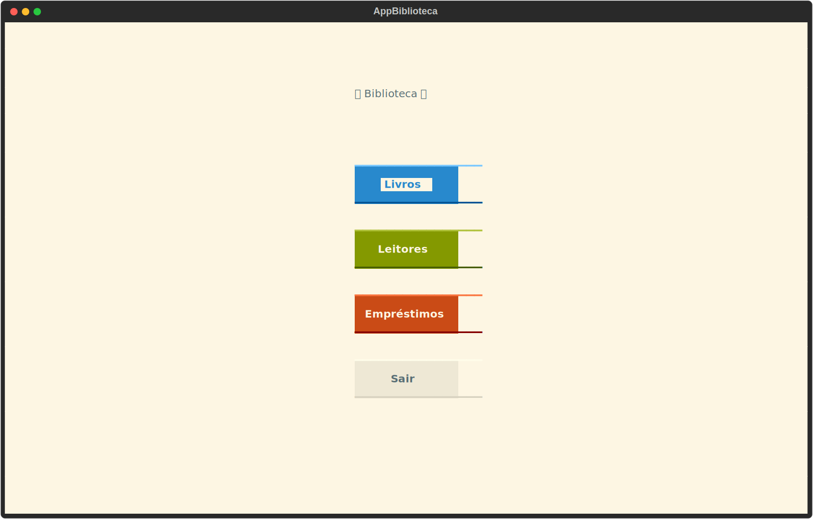
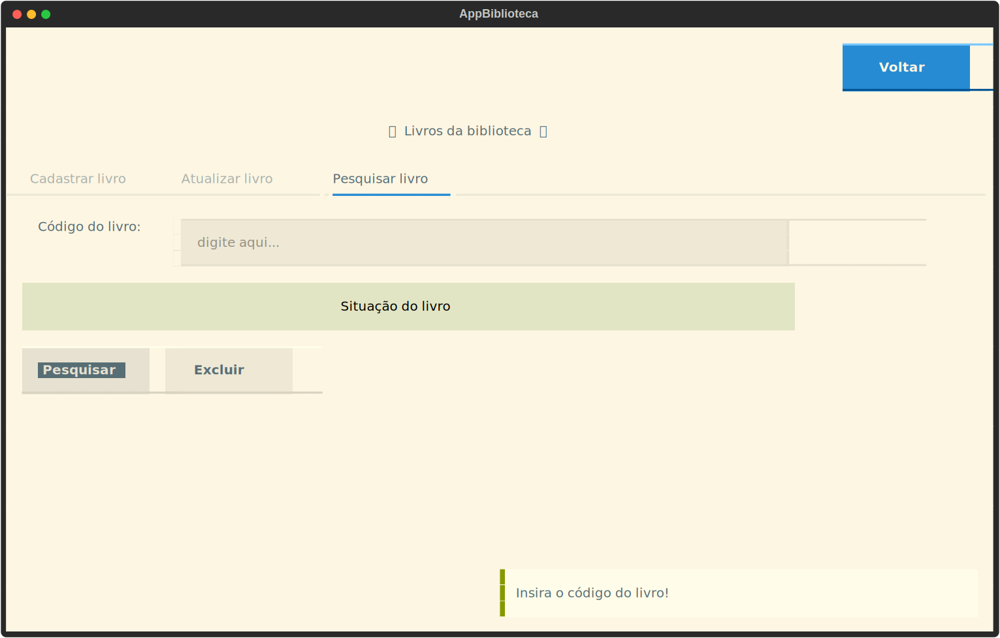
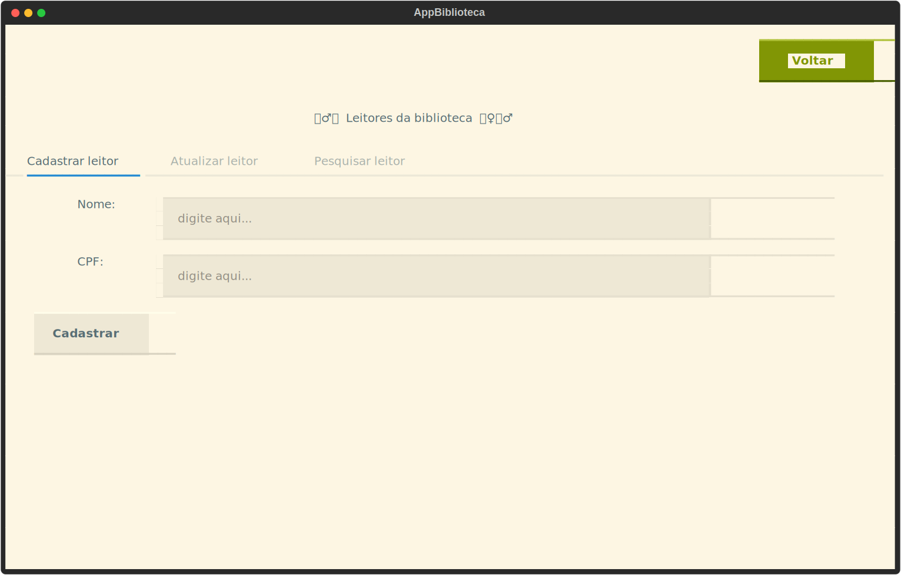
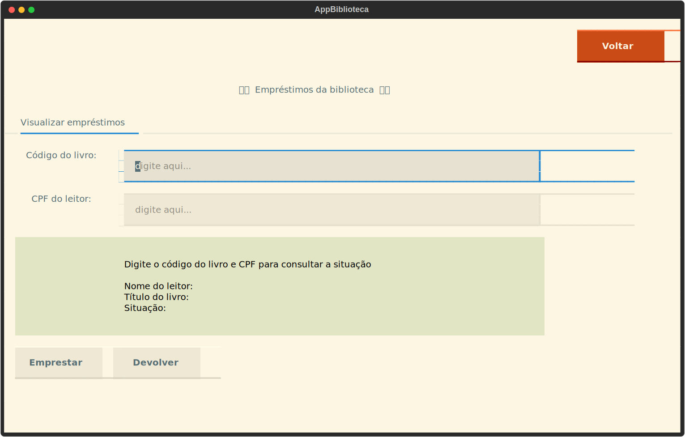

# Projeto de Biblioteca

Neste projeto, simulamos uma biblioteca simples com Python e Textual como atividade do curso Técnico em Desenvolvimento de Sistemas.

A model foi desenvolvida em conjunto entre turma e professor, com adaptações para cada projeto.
A view, feita com o framework Textual, foi desenvolvida como forma de atividade individual.

